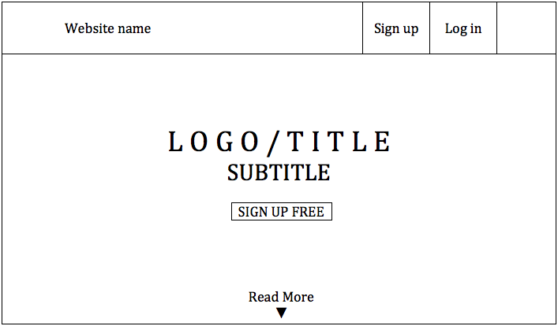
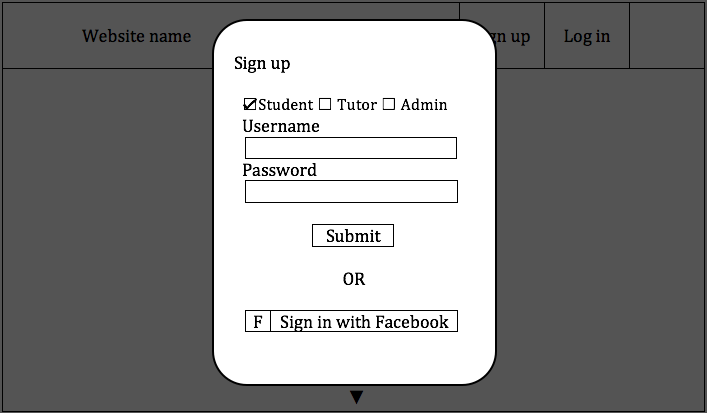
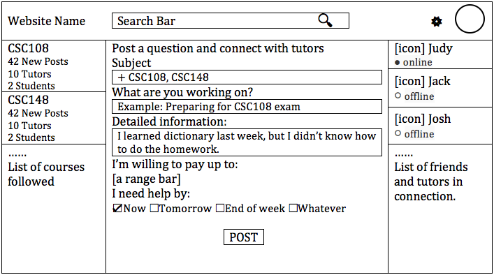
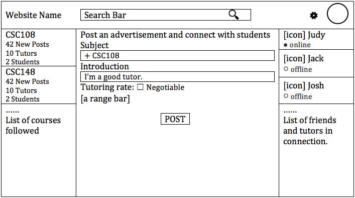
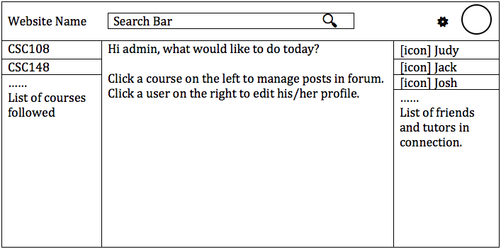
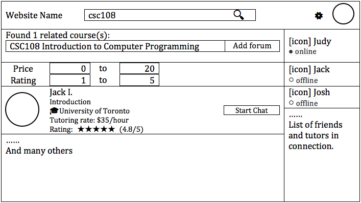
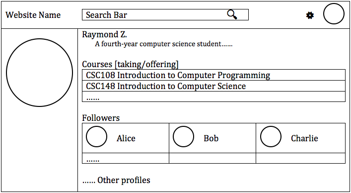
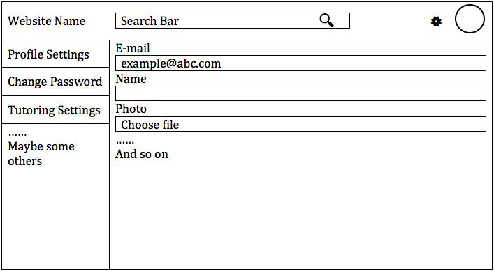
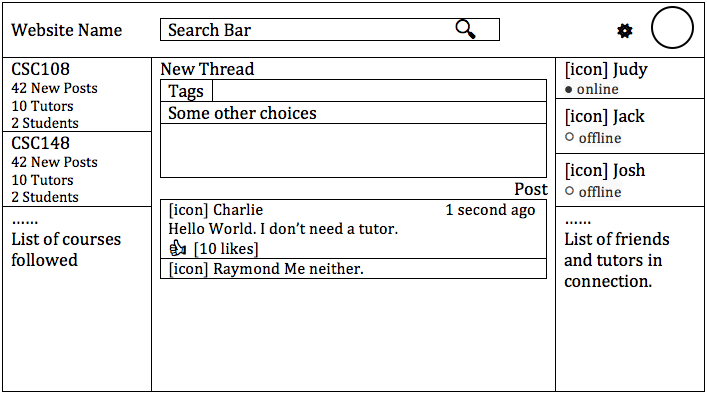
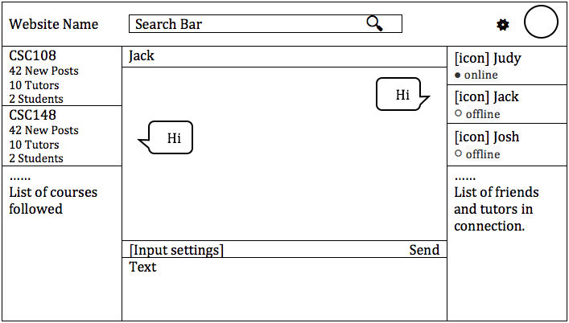

# Project Proposal

## Topic

* **Topic:** Tutor Website for U of T students.

* **Purpose:** Allow students to find tutors for courses.

* **Serve:** Allow users to connect with other students in order to get help for courses they are enrolled in.

## List of the user interactions

Users can sign up to be a tutor by creating a tutor profile which showcases their qualifications.

Once a user is a tutor they can chat with students who want to connect and set times and places to meet up. Each tutor is certified and guaranteed to be knowledgeable in each course they tutor.

Students can search for tutors based on course / rating / tutor name. They can also view the profile of each tutor to see if the tutor is a right fit, and if so can message the tutor directly to get the support they need. Students can post in forums regarding a specific course that allows them to get answers from other students (not tutors) quickly.

## Getting data into application

* **Profile:** Information given by user, when they sign up.

* **Posts / Messages:** all based on user input.

* **Course Information:** We will scrape the course data from the U of T Arts & Science course offerings website and input that data into the database. Therefore, when the user signs up to be a tutor they can select the courses they want to tutor from a static list, given by our database.

## Sketches

### Start-up



### Sign up



### Upon logged in as student



### Upon logged in as tutor



### Upon logged in as admin



### Search



### Profile



### Edit profile



### Course forum



### Private chat


